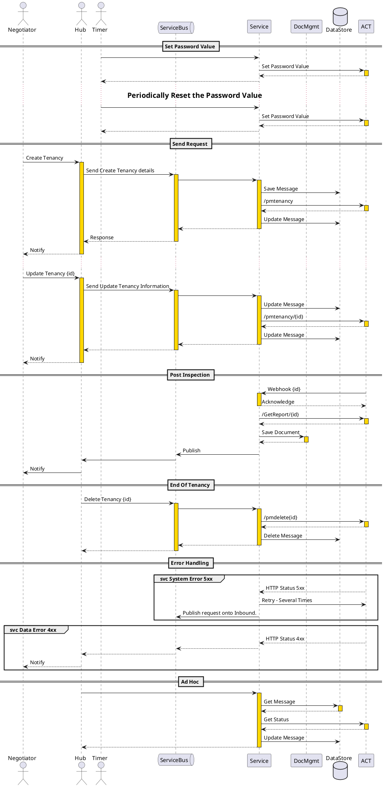

# Service Handler

ACT is a third party property inspection service.



## Security

All calls to ACT are authorised by specifying in the header a API key (x-api-key).

Because the information we are passing is sensitive personal information the JSON payload will need to be encrypted.
Periodically a key will need to be shared with ACT so that communication security can be maintained. 

### Encrypt
```C#
using System;
using System.IO;
using System.Security.Cryptography;

        static string EncryptString(string plaintext, string password)
        {
            // Convert the plaintext string to a byte array
            byte[] plaintextBytes = System.Text.Encoding.UTF8.GetBytes(plaintext);
 
            // Derive a new password using the PBKDF2 algorithm and a random salt
            Rfc2898DeriveBytes passwordBytes = new Rfc2898DeriveBytes(password, 20);
 
            // Use the password to encrypt the plaintext
            Aes encryptor = Aes.Create();
            encryptor.Key = passwordBytes.GetBytes(32);
            encryptor.IV = passwordBytes.GetBytes(16);
            using (MemoryStream ms = new MemoryStream())
            {
                using (CryptoStream cs = new CryptoStream(ms, encryptor.CreateEncryptor(), CryptoStreamMode.Write))
                {
                    cs.Write(plaintextBytes, 0, plaintextBytes.Length);
                }
                return Convert.ToBase64String(ms.ToArray());
            }
        }
```

### Decrypt
```C#
using System;
using System.IO;
using System.Security.Cryptography;

        static string DecryptString(string encrypted, string password)
        {
            // Convert the encrypted string to a byte array
            byte[] encryptedBytes = Convert.FromBase64String(encrypted);
 
            // Derive the password using the PBKDF2 algorithm
            Rfc2898DeriveBytes passwordBytes = new Rfc2898DeriveBytes(password, 20);
 
            // Use the password to decrypt the encrypted string
            Aes encryptor = Aes.Create();
            encryptor.Key = passwordBytes.GetBytes(32);
            encryptor.IV = passwordBytes.GetBytes(16);
            using (MemoryStream ms = new MemoryStream())
            {
                using (CryptoStream cs = new CryptoStream(ms, encryptor.CreateDecryptor(), CryptoStreamMode.Write))
                {
                    cs.Write(encryptedBytes, 0, encryptedBytes.Length);
                }
                return System.Text.Encoding.UTF8.GetString(ms.ToArray());
            }
        }
```


## API

For all ACT API information, I recommend you look at the ACT OpenAPI Site  https://app.swaggerhub.com/apis/ACTProperty/ACTAPI/1.1.0


* Create Tenancy 
    * Schedule a new tenancy for inspection 
    * returns - Confirmation and estimated inspection dates
    * URL : /pmtenancy
    * HTTP Method : POST
    * Request
        ```json
            {
                "tenancy": "string<base64>"
            }
        ```
    * Response
        ```json
            {
                "success": true,
                "message": "Tenancy created successfully"
            }
        ```
  * HTTP Errors

    | Error | Meaning        |
    | ----- | -------------- |
    | 2xx   | OK(Success)    |
    | 400   | Invalid Input Data   |

* Update Tenancy
    * Update Tenancy/Occupier and or inspection dates
    * returns - Confirmation and estimated inspection dates
    * URL : /pmtenancy/{id}
    * HTTP Method : PUT
    * Request
        ```json
            {
                "tenancy": "string<base64>"
            }
        ```
    * Response
        ```json
            {
                "success": true,
                "message": "Tenancy updated successfully"
            }
        ```
  * HTTP Errors

    | Error | Meaning        |
    | ----- | -------------- |
    | 2xx   | OK(Success)    |
    | 400   | Invalid Input Data   |
    | 404   | Tenancy Id Not Found |

* Delete Tenancy
    * Removes a Tenancy and all its associated information.
    * Cancels any planned inspections
    * returns - Confirmation
    * URL : /pmtenancy/{id}
    * HTTP Method : DELETE
    * Request
        N/A
    * Response
        ```json
            {
                "success": true,
                "message": "Tenancy deleted successfully"
            }
        ```
  * HTTP Errors

    | Error | Meaning               |
    | ----- | --------------        |
    | 200   | OK(Success)           |
    | 404   | Tenancy Id Not Found  |

* Get Report
    * Requests a report for a Tenancy.
    * Returns Report
    * URL : /getreport/{tenancyid}
    * HTTP Method GET
    * Request

    * Response
    ```json
        {
            "report_url": "https://downloads.actproperty.co.uk/downloads/86360/86360 - Property Visit - The Old Gospel Hall.pdf",
            "date": "28/01/2025"
        }
    ```
  * HTTP Errors

    | Error | Meaning               |
    | ----- | --------------        |
    | 200   | OK(Success)           |
    | 404   | Tenancy Id Not Found  |


* Webhook Report Ready
    * Indicates a inspection report is ready, for which tenancy

* Get Tenancies
    * Returns a list of all tenancies and there proposed inspection dates.

